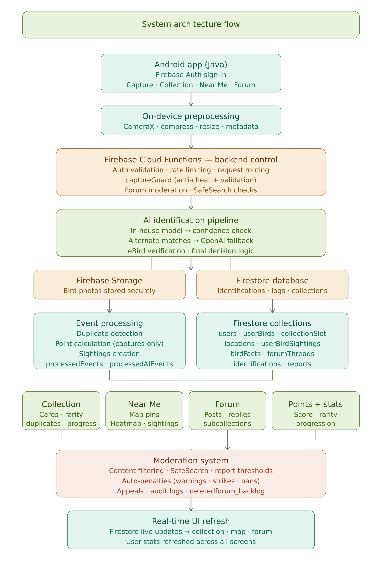
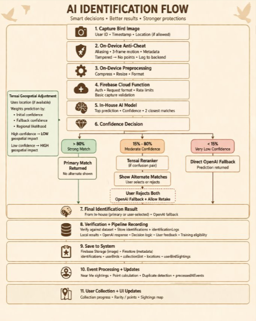
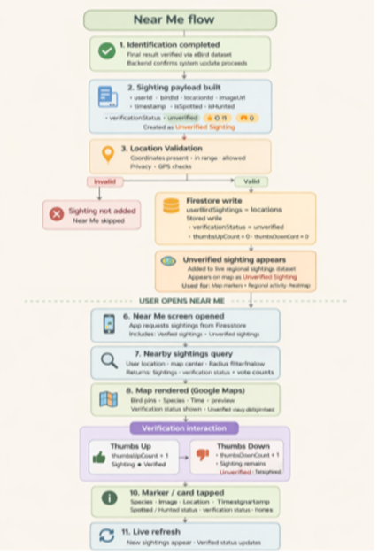
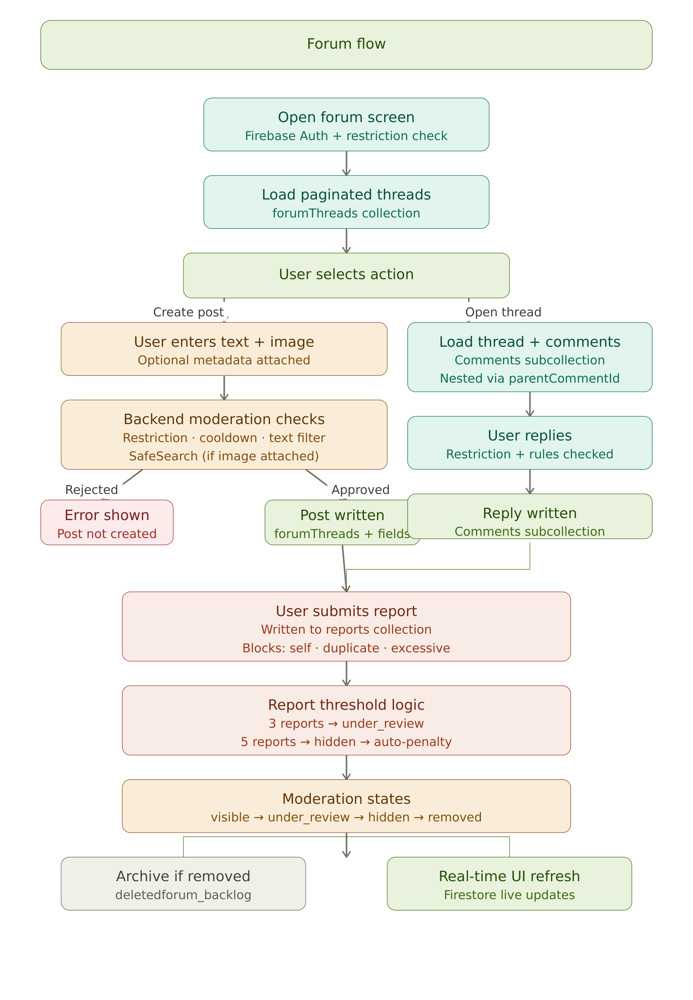

# 🐦 BirdDex

## Executive Summary

BirdDex is a production-ready mobile system that integrates artificial intelligence, cloud computing, and geospatial data processing to support real-time bird identification and ecological observation. The platform utilizes a multi-stage AI pipeline with confidence-based decision logic, user-assisted validation, and external dataset verification to ensure accurate and traceable species identification. Built on a Firebase cloud architecture, BirdDex manages user data, biological classification, sightings, and community interactions through a scalable NoSQL database and event-driven backend processes. The system extends beyond identification by incorporating a moderated forum and a points-based leaderboard, enabling both reliable data collection and sustained user engagement. This architecture demonstrates how AI-driven applications can be designed to produce verifiable, scalable, and user-driven environmental data systems.

---

## 📖 Overview

BirdDex is a **production-ready, AI-powered mobile platform** for bird identification, ecological data collection, and community interaction.

The system integrates:

* 🤖 Multi-stage AI identification pipeline
* 🌍 Real-time geospatial sightings (Near Me)
* 🧠 Structured biological classification modeling
* 💬 Moderated community forum
* 🏆 Competitive leaderboard system
* ☁️ Cloud-native Firebase architecture

BirdDex provides a **complete, scalable solution** for collecting, verifying, and interacting with ecological data in real time.

---

## 🏗 System Architecture



The backend serves as a centralized control layer responsible for validation, moderation, and system consistency. 

---

## 🤖 AI Identification System

BirdDex uses a **multi-stage AI pipeline**:

* In-house AI generates predictions and confidence scores
* Low-confidence results trigger user-assisted refinement
* OpenAI is used as a fallback
* Final results are verified against a trusted dataset

Each identification stores the **full decision pipeline**, including:

* Model outputs
* Confidence logic
* User feedback
* Final verified result

This ensures **traceability, reliability, and continuous improvement**. 

---

## 🌍 Near Me System

The Near Me system enables **real-time regional bird discovery**:

* Sightings stored in `userBirdSightings`
* GPS validation ensures accurate location data
* Map-based interface displays nearby birds

Each sighting includes:

* Species details
* Timestamp
* Image preview
* Verification status

Community validation allows sightings to transition from **unverified to verified**, improving overall data accuracy. 

---

## 💬 Forum System

BirdDex includes a **real-time, moderated discussion platform**:

* Threaded posts (`forumThreads`)
* Nested replies (`parentCommentId`)
* Real-time updates via Firestore

### Moderation

The forum operates on an **event-driven moderation system**:

* Content states:

  * `visible → under_review → hidden → removed`
* Report thresholds:

  * 3 reports → under review
  * 5 reports → hidden

Automatic enforcement includes:

* Warnings
* Strikes
* Temporary suspensions
* Permanent bans

All moderation actions are logged and reversible through an appeals system. 

---

## 🏆 Leaderboard System

BirdDex includes a **points-based leaderboard system** designed to encourage engagement and accurate data contribution.

### Scoring

Points are awarded for:

* Verified bird identifications
* Unique species discoveries
* Valid sightings

Points are stored in the user profile (`totalPoints`) and updated through backend event processing. 

### Ranking

Users are ranked based on:

* Total points
* Bird discovery count
* Activity level

### Impact

The leaderboard:

* Encourages sustained engagement
* Incentivizes accurate identifications
* Supports long-term user retention

---

## 🧩 Data Architecture

BirdDex uses **Firebase Cloud Firestore (NoSQL)** to support scalable and real-time operations.

### Core Collections

* `users` → profiles and leaderboard data
* `birds` → taxonomy
* `userBirds` → captured birds
* `identifications` → AI pipeline records
* `locations` → geospatial data
* `userBirdSightings` → Near Me system
* `forumThreads` → forum posts
* `reports` → moderation system

The database is designed for:

* Event-driven processing
* Separation of media and metadata
* AI traceability
* Real-time synchronization


---

## ⚙️ Event Processing

Backend event processing handles:

* Point calculation and leaderboard updates
* Duplicate detection
* Sighting creation
* AI logging

This architecture ensures:

* System consistency
* Scalability
* Reduced frontend complexity

---

## 🎯 Core Features

### 📸 Identification

* AI-powered recognition
* Confidence-based decision logic
* Fallback verification

### 🧬 Collection

* Persistent bird catalog
* Rarity tiers and progression
* Duplicate detection

### 🗺 Near Me

* Live map-based sightings
* Community verification
* Regional tracking

### 💬 Forum

* Real-time discussions
* Moderated content
* Nested replies

### 🏆 Leaderboard

* Points-based ranking
* Competitive engagement system

---

## 🛡 Safety & Moderation

BirdDex enforces platform integrity through:

* Automated content filtering
* Report-based moderation
* Rate limiting and anti-abuse controls
* Appeals and audit logging

This ensures a **safe and controlled user environment**. 

---

## 🚀 Deployment

BirdDex is deployed using:

* Firebase Authentication
* Firebase Cloud Functions
* Firebase Cloud Firestore
* Firebase Cloud Storage

The system is fully operational within a cloud-native environment.

---

## 🧪 Testing & Validation

The system has been validated through:

* End-to-end workflow testing
* AI pipeline accuracy testing
* Moderation system validation
* Real-time update verification

All core flows operate as expected:

* Identification
* Collection
* Near Me
* Forum
* Leaderboard

---

## ⚙️ Setup Instructions

The following steps outline how to configure and run BirdDex locally for development and testing.

---

### 📋 Prerequisites

Ensure the following are installed:

* Android Studio (latest version recommended)
* Java Development Kit (JDK 11 or higher)
* Android Emulator or physical Android device
* Firebase account

---

### 📥 Clone the Repository

```bash
git clone https://github.com/Georgia-Southwestern-State-Univeristy/capstone-project-birddex.git
cd capstone-project-birddex
```

---

### 🔧 Android Studio Setup

1. Open Android Studio
2. Select **“Open an existing project”**
3. Navigate to the cloned repository
4. Allow Gradle to sync dependencies

---

### 🔥 Firebase Configuration

BirdDex relies on Firebase services for authentication, storage, and database functionality.

#### 1. Create Firebase Project

* Go to Firebase Console
* Create a new project

#### 2. Add Android App

* Register your app using your package name
* Download `google-services.json`

#### 3. Add Config File

Place the file in:

```text
/app/google-services.json
```

#### 4. Enable Firebase Services

Enable the following:

* Authentication (Email/Password)
* Cloud Firestore
* Cloud Storage
* Cloud Functions

---

### ⚡ Cloud Functions Setup (Backend)

Navigate to the functions directory:

```bash
cd functions
npm install
```

Deploy functions:

```bash
firebase deploy --only functions
```

---

### ▶️ Run the Application

1. Connect a device or start an emulator
2. Click **Run** in Android Studio
3. Log in or create a user account

---

### 🧪 Test Core Features

Once running, verify:

* Bird identification (camera or upload)
* Collection updates
* Near Me map functionality
* Forum posting and moderation
* Leaderboard updates

---

### ⚠️ Notes

* Firebase credentials are not included in this repository
* API usage (OpenAI / eBird) may require valid keys
* Emulator location services must be enabled for Near Me

---

## 🛠 Troubleshooting

### Gradle Build Issues

* Ensure correct JDK version
* Re-sync Gradle
* Invalidate caches and restart Android Studio

### Firebase Connection Issues

* Verify `google-services.json` placement
* Confirm Firebase project configuration
* Check Firestore rules and indexes

### Emulator Location Issues

* Manually set location in emulator settings
* Ensure location permissions are enabled

---

## 📌 Conclusion

BirdDex delivers a **complete and scalable system** for AI-assisted ecological observation.

The platform integrates:

* Artificial intelligence
* Geospatial processing
* Cloud-based infrastructure
* Real-time user interaction
* Gamified engagement systems

This implementation demonstrates how modern software architecture can be used to produce **accurate, verifiable, and scalable environmental data systems**.

---
